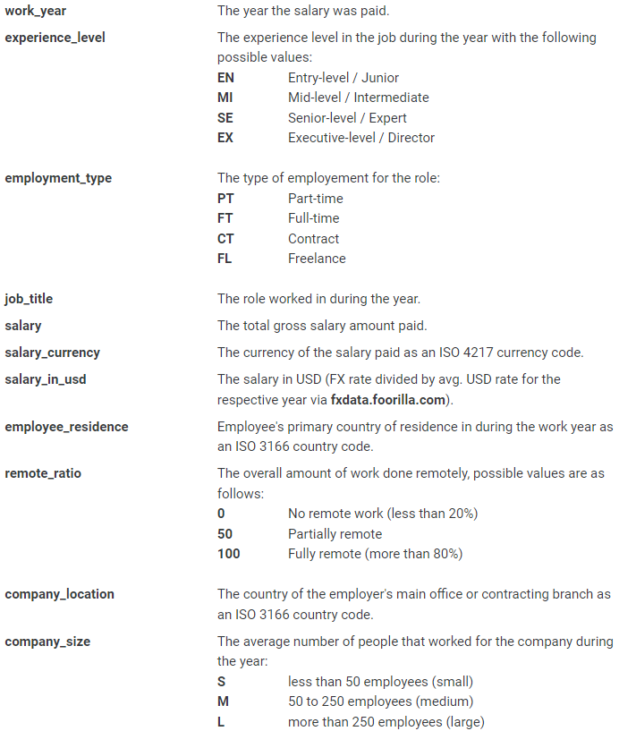

```{r setup, include=FALSE}
knitr::opts_chunk$set(echo = TRUE)
options(scipen=999)

# set working directory
setwd("C:/Users/aanan/Documents/GitHub/ANLY500Project/") # Team, please change this to a directory on your computer when you add code, else your code won't execute

# add packages
library("dplyr")
library("ggplot2")
```

```{r read data, echo=FALSE, results='hide'}
Salaries <- read.csv("salaries.csv")
```

### Abstract

[[Add summary of our report when analyses is complete.]]

### Index Terms / Keywords

[[Complete list of keywords/acronyms that we reference.]]

AI: Artificial Intelligence
DS: Data Science
ML: Machine Learning
USD: United States Dollar

### Introduction

A shift towards data-centered decision-making is taking hold and at the center of this shift are those working in the fields of data science ("DS"), artificial intelligence ("AI"), and machine learning ("ML"). As businesses seek to optimize operations and information using vastly increased computing power, the shape and size of data analytics has increased exponentially over the last two decades, and even more prominently in the last decade with the rise of machine learning, cloud computing, and advances in the field of artificial intelligence.

Exploring the composition and trends of salaries in this sector is equally as intriguing, both from a research perspective and from the perspective of what can be waiting for students of Data Analytics (DS/AI/ML) in academic programs globally.

The data we've chosen for this project comes from https://salaries.ai-jobs.net/, a website collecting salary data from around the world.

This data set has salary (in USD) for a variety of technical roles, and a variety of information on the characteristics of the employee, employer, the job itself, and the market.

The data set contains the following variables:

```{r pressure, echo=FALSE, fig.cap="A caption", out.width = '100%'}

```

### Citations and Related Work (> Siming)

[[Add citations we consulted, and a summary of related work!]]

### Data

#### Data Cleaning (> Abhishek)

Follow all cleaning steps outlined in class
_clean.csv

```{r data cleaning, echo=FALSE}
head(Salaries)
```

#### Recode

```{r recode categorical variables, echo=FALSE,results='hide'}
#Salaries$experience_level <- recode(Salaries$experience_level, EN = 1, MI = 2, SE = 3, EX = 4)
#Salaries$employment_type <- recode(Salaries$employment_type, PT=1, FT=2, CT=3, FL=4)
#Salaries$company_size <- recode(Salaries$company_size, S = 1, M = 2, L = 3)
#Salaries$remote_ratio <- recode(Salaries$remote_ratio, "0" = 1, "50" = 2, "100" = 3)
```

#### Remove Redundant Data

```{r remove redundant data}
Salaries <- Salaries[,c(1:4,7,9:11)]
```

#### Convert to Factor (may not be needed, but leaving it here for now)

```{r}
#Salaries$remote_ratio <- as.factor(Salaries$remote_ratio)
#Salaries$experience_level <- as.factor(Salaries$experience_level)
#Salaries$employment_type <- as.factor(Salaries$employment_type)
#Salaries$company_size <- as.factor(Salaries$company_size)
#Salaries$remote_ratio <- as.factor(Salaries$remote_ratio)
```

#### Missing Data

```{r}
summary(Salaries[c(1:3,5:6,8)])
```
```{r}
sum(is.na(Salaries))
```

There are no missing data in our data set. Also, as we see from the summaries above, all the categorical factors and the continuous variables are correctly assigned.

#### Means

```{r}
round(apply(Salaries[,-c(4,7)],2,mean),1)
```
#### Standard Deviations

```{r}
round(apply(Salaries[,-c(4,7)],2,sd),1)
```

#### Outliers

```{r}
mahal <- mahalanobis(Salaries[,-c(4,7)],
                     colMeans(Salaries[,-c(4,7)]),
                     cov(Salaries[,-c(4,7)],use = "pairwise.complete.obs"))

cutoff <- qchisq(1-0.001,ncol(Salaries[,-c(4,7)]))
```

```{r}
ncol(Salaries[,-c(4,7)])
```

```{r}
summary(mahal < cutoff)
```

From the above summary, we see that of the 978 rows of data, 31 contain outliers. The other 947 do not. We will remove the 31 rows to create a data set without outliers.

```{r}
Salaries_Outliers <- subset(Salaries, mahal >= cutoff)
Salaries_NoOutliers <- subset(Salaries, mahal < cutoff)
write.csv(Salaries_NoOutliers, "salaries_clean.csv")
Salaries_clean <- read.csv("salaries_clean.csv")
```

#### Summary of Data (> Bolun)

- median, mean, sd, range, IQR
- anything else discussed in class
- maybe include boxplots

```{r}
## AA note, please use "Salaries" rather than "Salaries_clean" for summary of data
cleanup <- theme(panel.grid.major = element_blank(), #no grid lines
                panel.grid.minor = element_blank(), #no grid lines
                panel.background = element_blank(), #no background
                axis.line.x = element_line(color = 'black'), #black x axis line
                axis.line.y = element_line(color = 'black'), #black y axis line
                legend.key = element_rect(fill = 'white'), #no legend background
                text = element_text(size = 12)) #bigger text size


summary(Salaries)

## Output below gives us a general representation of how the data looks like.
```

[[Add language describing data.]]

#### Descriptive Statistics (> Bolun)

```{r}

```

[[Add language summarizing descriptive statistics.]]

#### Descriptive Plots 

##### Scatterplots (> Bolun)

```{r}
plot(x=Salaries_clean$experience_level, y=Salaries_clean$salary_in_usd, 
     xlab = "Experience_Level",
     ylab = "Salary",
     main = "Experience vs Salary",
     col="purple", 
     pch =19)

plot(x=Salaries_clean$work_year, y=Salaries_clean$salary_in_usd, 
     xlab = "work_year",
     ylab = "Salary",
     main = "work_year vs Salary",
     col="purple", 
     pch =19)

plot(x=Salaries_clean$employment_type, y=Salaries_clean$salary_in_usd, 
     xlab = "employment_type",
     ylab = "Salary",
     main = "employment_type vs Salary",
     col="purple", 
     pch =19)

# From the descriptive Scatter plot, we can see that generally speaking, the higher the experience level is, the higher the Salary will be.
# Similarly, the more work year, the higher the Salary. 
```

[[Add language summarizing the relationships shown in descriptive plots.]]

##### Barplots / Histograms (> Abhishek)

```{r}
hist(Salaries$salary_in_usd, breaks = 40, main = paste("Salaries of Data Roles in Tech"),xlab = "Salaries", ylab = "No. of Employees", xlim = c(0,600000), ylim = c(0,150))
```

```{r}
bar1 <- ggplot(Salaries, aes(experience_level, salary_in_usd, fill = company_size))

bar1 + 
  stat_summary(fun = mean,
               geom = "bar",
               position = "dodge") +
  stat_summary(fun.data = mean_cl_normal,
               geom = "errorbar",
               position = position_dodge(width = 0.90),
               width = 0.2) +
  xlab("Experience Level") +
  ylab("Salary") +
  cleanup +
  scale_fill_manual(name = "Company Size",
                    labels = c("Large", "Medium", "Small"),
                    values = c("blue", "darkgreen", "maroon"))
```


[[Text describing the histogram/distribution of salaries]].

```{r}

```


[[Add language summarizing the relationships shown in descriptive plots.]]

##### Multivariate plots (> Abhishek)

```{r}

```

[[Add language summarizing the relationships shown in descriptive plots.]]

[[Overarching summary of plots.]]

#### Assumptions Tests

##### Additivity (Rijin)

```{r}

```

##### Linearity (Rijin)

```{r}

```


##### Homogeneity (Rijin)

```{r}

```

##### Normality (Rijin)

```{r}

```

[[Summary of the tests.]]

#### Correlation Check / Comments

```{r}

```

[[Describe any correlations that were observed. How did we deal with this?]]

### Technical Approach (> Siming)

[[Language on our overall approach to the analysis.]]

#### Modeling (All)

#### Linear models

```{r}

```

#### t-tests

```{r}

```

#### ANOVA tests

```{r}

```


### Findings (Siming + All)


### Conclusion (Siming + All)


### Future Studies (All)


